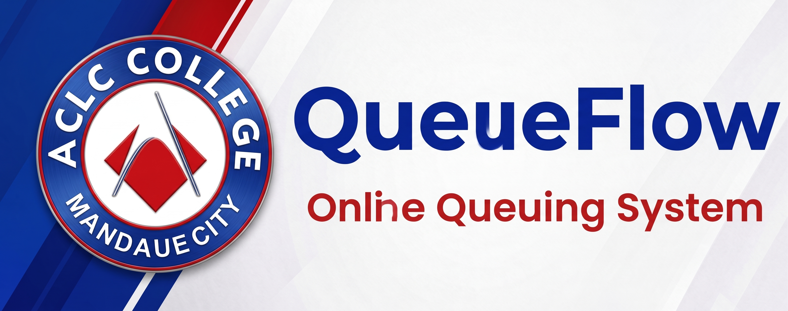

<p align="center">
  
</p>

# Online Queuing System

A modern, efficient Online Queuing System built with Laravel and Livewire to streamline line management and optimize customer flow. This system is designed to provide real-time queue status updates, assign users to tellers, and manage queue progression dynamically.

##  Features

- **Automated Ticket Generation:** Automatically generates sequential tracking numbers (e.g., `TKT-001`) for new queue entries.
- **Dynamic Status Tracking:** Monitors tickets through various lifecycle states:
  - `holding` (Waiting in the general queue)
  - `active` (Moved to the active queue, max capacity of 5)
  - `serving` (Currently being served by a teller)
  - `held` (Temporarily paused/held by teller)
  - `completed` (Successfully served)
- **Teller Queue Management:** Comprehensive operations for tellers including calling the next ticket, holding, and completing current tickets.
- **Smart Active Queue Balancing:** Automatically fills the active queue up to maximum capacity (default: 5) as tickets are served and completed.

##  Tech Stack

- **Framework:** Laravel 11.x
- **Language:** PHP 8.3
- **Frontend / Interactivity:** Livewire 3.x / Livewire Volt
- **Testing:** Pest PHP
- **Database:** SQLite (default) / MySQL / PostgreSQL

##  Installation

Follow these steps to set up the project locally:

1. **Clone the repository:**
   ```bash
   git clone <your-repo-url>
   cd Online-Queuing-System-andrew
   ```

2. **Install Composer dependencies:**
   ```bash
   composer install
   ```

3. **Install NPM packages and build assets:**
   ```bash
   npm install
   npm run build
   ```

4. **Set up the environment:**
   ```bash
   cp .env.example .env
   php artisan key:generate
   ```

5. **Run Database Migrations:**
   ```bash
   php artisan migrate
   ```

6. **Start the development server:**
   ```bash
   php artisan serve
   ```
   Navigate to `http://localhost:8000` in your browser.

##  System Architecture

### Core Models
- `QueueTicket`: The central entity managing the ticketing information, capturing the user's name, tracking number, and current status.
- `User`: Handles teller and admin authentication and access control.

### Core Controllers
- `QueueController`: Manages the business logic for the queue lifecycle:
  - `requestQueue(string $studentName)`: Adds a user to the holding queue.
  - `startQueue(string $tellerName)`: Initializes the teller session.
  - `callNext(string $tellerName)`: Pulls the next active ticket for serving.
  - `holdCurrent(string $tellerName)` / `completeCurrent(string $tellerName)`: Updates ticket states accordingly.

##  Contributing

Contributions, issues, and feature requests are welcome!

1. Fork the Project
2. Create your Feature Branch (`git checkout -b feature/AmazingFeature`)
3. Commit your Changes (`git commit -m 'Add some AmazingFeature'`)
4. Push to the Branch (`git push origin feature/AmazingFeature`)
5. Open a Pull Request

##  License

This project is licensed under the MIT License.
